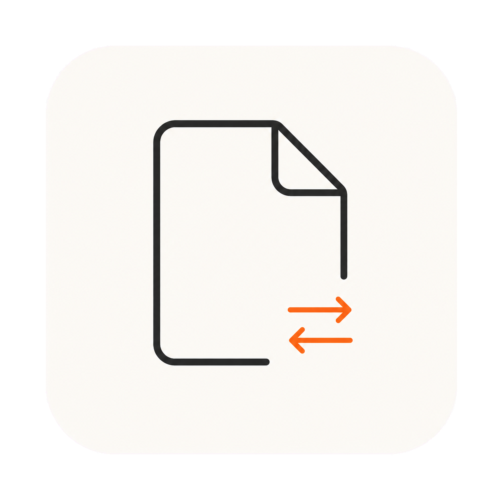
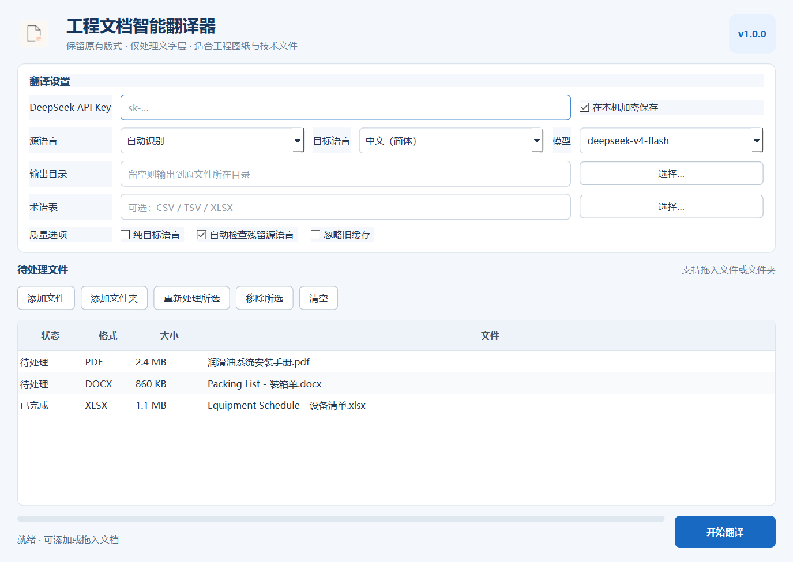

<p align="center">
  
</p>

<h1 align="center">文档智能翻译器</h1>
<h3 align="center">Document Translator · v1.3.0</h3>

<p align="center">
  保留版式、保护技术编号，批量翻译 PDF、Word、Excel 和 CSV 等文档。<br>
  Translate PDF, Word, Excel, and CSV documents while preserving layout and technical identifiers.
</p>

<p align="center">
  <a href="https://github.com/WANG40929/engineering-document-translator/releases/latest"></a>
  
  <a href="LICENSE.txt"></a>
</p>

<p align="center">
  <strong><a href="https://github.com/WANG40929/engineering-document-translator/releases/latest">下载 Windows 版本 / Windows downloads</a></strong>
  · <a href="#中文">中文</a>
  · <a href="#english">English</a>
  · <a href="CHANGELOG.md">更新日志 / Changelog</a>
</p>



---

<a id="中文"></a>

## 中文

### 选择下载版本

v1.3.0 提供三种 Windows 版本：

| 版本 | 包含 BabelDOC 智能 PDF 引擎 | 适合谁 |
|---|---:|---|
| **Windows Setup Full（安装完整版）** | 是 | 推荐大多数用户；按向导安装，智能 PDF 引擎默认内置 |
| **Portable Full（免安装完整版）** | 是 | 不希望安装；解压完整文件夹后使用 |
| **Portable Lite（免安装轻量版）** | 否 | 主要翻译 Word、Excel、CSV、图纸或短标签 PDF；也可自行安装 BabelDOC |

安装向导支持简体中文、英语、俄语、西班牙语、法语和德语，并在每次启动时按 Windows 界面语言自动选择。

安装包和压缩包名称均使用英文、数字等 ASCII 字符，避免在不同解压软件中出现乱码。每个发布包都提供浏览器可直接打开的 `ReadMe.html` 和普通文本 `ReadMe.txt`，不要求用户会打开 Markdown 文件。详细区别和 Lite 版安装引擎的方法见 [下载版本说明](docs/DOWNLOADS.md)。

### 开始使用

1. 从 [Releases](https://github.com/WANG40929/engineering-document-translator/releases/latest) 选择上面的一种 Windows 安装包或压缩包。
2. 打开软件，在“设置”中填写自己的 DeepSeek API Key，并选择目标语言。
3. 拖入文件或文件夹，点击“开始翻译”。
4. 完成后直接点击“打开文件”或“打开文件夹”查看结果。

源文件不会被覆盖，译文会自动添加语言后缀。程序界面支持跟随系统语言，也可手动切换为：

- 简体中文
- English
- Русский（俄语）
- Español（西班牙语）
- Français（法语）
- Deutsch（德语）

### 支持的文档

| 格式 | 处理方式 | 主要保留内容 |
|---|---|---|
| PDF | 自动选择智能排版或原位保版；可生成纯译文或双语 PDF | 图片、矢量线条、页面尺寸和页数 |
| DOCX | 翻译正文、表格、页眉和页脚 | 段落、表格和主要字符样式 |
| XLSX / XLSM | 只翻译字符串单元格 | 公式、数值、样式和工作表结构 |
| CSV / TSV | 按检测到的编码和分隔符读写 | 行列结构和分隔符 |
| DOC | 通过本机 Microsoft Word 转换并回存 | 原 `.doc` 格式；需要安装 Word |

只翻译已有文字层；扫描图片、PDF 转曲文字和没有文字层的页面不会翻译。

### v1.3.0 重点改进

- **更快启动：** 主界面按需加载翻译组件，改用文件夹式程序结构，并用轻量启动画面提示正在打开。
- **可用的 PDF 进度：** 显示解析、版面分析、术语、翻译、排版、字体和保存等真实阶段，同时显示已用时间与动态预计剩余时间。
- **直接打开结果：** 每个已完成任务都可打开译文或所在文件夹。
- **在不降低质量的前提下提速：** 多批次翻译并行处理，受速率限制时自动退让；已完成批次及时写入缓存，重试和后续文件可继续复用。
- **技术内容保护：** 图号、物料号、KKS、标准号、尺寸、单位和网址等在翻译前受到保护。
- **稳定的缓存上限：** 译文缓存仍限制为 100 MB，超过后按时间删除最旧记录并压缩至约 90 MB。

### PDF 引擎与术语

“智能排版”使用 [BabelDOC](https://github.com/funstory-ai/BabelDOC)，适合报告、手册和连续正文；“原位保版”适合工程图纸、图签、设备标签和短文本。Setup Full 和 Portable Full 已包含 BabelDOC；Portable Lite 找不到该引擎时会安全回退到原位保版。

BabelDOC 的程序、布局模型和字体不属于 100 MB 译文缓存，也不会被缓存清理。API Key 仅通过任务临时配置传递，任务结束后删除，并从错误信息中脱敏。

软件支持 CSV、TSV、TXT 和 XLSX 术语表。用户选择的术语表会被记住，并在后续文件中继续使用。智能 PDF 可进行当前文档内的术语提取，但本版本**不会自动建立并永久积累一个可审核的术语库**；译文缓存也不等于术语库。

### 已知限制

- 扫描件需要 OCR；本版本默认不处理没有文字层的页面。
- 很密集的 PDF 图签或明显变长的译文可能需要缩小字体。
- DOCX 文本框、SmartArt 和嵌入对象中的文字暂未处理。
- 旧版 `.doc` 支持依赖本机 Microsoft Word。
- 建议先用代表性文件验证术语和版式，再批量处理大型项目。

### 从源码运行

需要 Python 3.10 或更高版本：

```powershell
git clone https://github.com/WANG40929/engineering-document-translator.git
cd engineering-document-translator
python -m pip install -r requirements.txt
python -m translator_app
```

### 后续计划

- [ ] 可审核、可复用的自动术语库
- [ ] 可选 OCR 模块
- [ ] 更直观的翻译质量报告
- [ ] 自动更新提示

如果这个项目对你有帮助，欢迎点一个 **Star**，或通过 [Issues](https://github.com/WANG40929/engineering-document-translator/issues) 提交问题和建议。

---

<a id="english"></a>

## English

### Choose a download

Version 1.3.0 provides three Windows editions:

| Edition | BabelDOC smart PDF engine included | Recommended for |
|---|---:|---|
| **Windows Setup Full** | Yes | Recommended for most users; guided installation with the engine included by default |
| **Portable Full** | Yes | No installation; extract the complete folder before use |
| **Portable Lite** | No | Word, Excel, CSV, drawings, and short-label PDFs; BabelDOC can be installed separately |

The setup wizard supports Simplified Chinese, English, Russian, Spanish, French, and German, and detects the Windows UI language on every launch.

Package and archive names use ASCII characters to prevent garbled filenames in older archive tools. Every package contains a browser-friendly `ReadMe.html` and plain-text `ReadMe.txt`; users do not need a Markdown reader. See [Download Editions](docs/DOWNLOADS.md) for details and Lite-edition engine setup.

### Get started

1. Choose a Windows installer or portable archive from [Releases](https://github.com/WANG40929/engineering-document-translator/releases/latest).
2. Open the application, enter your DeepSeek API key under **Settings**, and select a target language.
3. Drop files or folders into the window and click **Start Translation**.
4. When a task finishes, use **Open file** or **Open folder** to view the result.

Source files are never overwritten; translated files receive a language suffix. The interface can follow Windows automatically or be set to Simplified Chinese, English, Russian, Spanish, French, or German.

### Supported documents

| Format | Processing | Mainly preserved |
|---|---|---|
| PDF | Automatic smart reflow or strict in-place placement; translated-only and bilingual output | Images, vector drawings, page sizes, and page count |
| DOCX | Body text, tables, headers, and footers | Paragraphs, tables, and primary character styles |
| XLSX / XLSM | String cells only | Formulas, values, styles, and workbook structure |
| CSV / TSV | Detected encoding and delimiter | Rows, columns, and delimiters |
| DOC | Conversion and save through local Microsoft Word | Legacy `.doc` format; Word is required |

Only existing text layers are translated. Scanned images, outlined PDF text, and pages without a text layer are left unchanged.

### Version 1.3.0 highlights

- **Faster startup:** Translation components load only when needed, the application uses a folder-based build, and a lightweight splash gives immediate feedback.
- **Useful PDF progress:** Parsing, layout analysis, terminology, translation, typesetting, fonts, and save stages are reported with elapsed time and a dynamic ETA.
- **Open completed results:** Open the translated file or its folder directly from each completed task.
- **Quality-preserving speed improvements:** Independent batches run concurrently, adaptive rate limiting backs off when required, and completed batches are checkpointed to cache for safe reuse.
- **Technical-token protection:** Drawing numbers, material IDs, KKS tags, standards, dimensions, units, and URLs are protected before translation.
- **Unchanged cache limit:** The translation cache remains capped at 100 MB and is compacted to about 90 MB by removing the oldest entries.

### PDF engine and terminology

Smart layout uses [BabelDOC](https://github.com/funstory-ai/BabelDOC) for reports, manuals, and prose-heavy documents. Strict in-place placement remains available for drawings, title blocks, equipment labels, and short text. Windows Setup Full and Portable Full include BabelDOC. Portable Lite falls back safely to strict placement when the engine is unavailable.

BabelDOC, its layout models, and fonts are application resources, not part of the 100 MB translation cache. The API key is passed through a per-task temporary configuration, deleted after the task, and redacted from backend errors.

User-supplied glossaries can be CSV, TSV, TXT, or XLSX. The selected glossary is remembered and reused for later files. Smart PDF mode can extract terms within the current document, but v1.3.0 **does not automatically build a permanent, reviewable terminology library**. The translation cache is not a terminology database.

### Known limitations

- Scanned pages require OCR; pages without a text layer are left unchanged by default.
- Dense PDF title blocks or substantially longer translations may require smaller fonts.
- Text inside DOCX text boxes, SmartArt, and embedded objects is not currently processed.
- Legacy `.doc` support requires Microsoft Word.
- Test representative files for terminology and layout before a large batch.

### Run from source

Python 3.10 or later is required:

```powershell
git clone https://github.com/WANG40929/engineering-document-translator.git
cd engineering-document-translator
python -m pip install -r requirements.txt
python -m translator_app
```

### Roadmap

- [ ] Reviewable, reusable automatic terminology library
- [ ] Optional OCR module
- [ ] Clearer translation quality reports
- [ ] Automatic update notifications

If this project is useful, please consider giving it a **Star**. Bug reports and suggestions are welcome in [Issues](https://github.com/WANG40929/engineering-document-translator/issues).

---

## License / 许可

AGPL-3.0-or-later. PyMuPDF is available under the AGPL or a commercial license. Closed-source commercial distribution requires an appropriate commercial license or a replacement PDF engine. See [LICENSE.txt](LICENSE.txt) and [THIRD_PARTY_NOTICES.md](THIRD_PARTY_NOTICES.md).

本项目采用 AGPL-3.0-or-later。PyMuPDF 使用 AGPL / 商业双重许可；闭源商业分发需要购买相应商业许可或更换 PDF 引擎。
